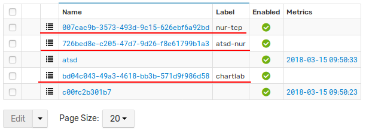
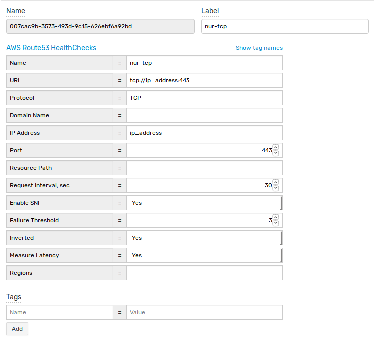

# AWS Route 53

This java application collect information about healthchecks on AWS Route53
and upload it into ATSD as entities with tags.

Result entities will look like following:





## Executing binaries

- Download jar from latest release at [Releases](https://github.com/axibase/atsd-integration/releases) page
- Create two files: **aws.properties** and **atsd.properties**

**aws.properties** file contains credentials for connecting to AWS Route53

```
aws.access.key=access_key
aws.secret.key=secret_key
aws.region=us-east-1
```

**atsd.properties** file contains parameters for connecting to ATSD using [atsd-api-java](https://github.com/axibase/atsd-api-java)

```
axibase.tsd.api.server.name=localhost
axibase.tsd.api.server.port=8443
axibase.tsd.api.protocol=https
axibase.tsd.api.ssl.errors.ignore=true
axibase.tsd.api.username=axibase
axibase.tsd.api.password=axibase
```

- Start application using following command (specify path to **aws.properties** and **atsd.properties** with **-Daws.properties** and **-Daxibase.tsd.api.client.properties** parameters)

```
java -Daxibase.tsd.api.client.properties=atsd.properties -Daws.properties=aws.properties -jar aws-route53-atsd-1.0-jar-with-dependencies.jar
```

- Check if entities were created in ATSD

## Build from source

- Clone repository

```
git clone -b aws-route53 https://github.com/axibase/atsd-integration
cd atsd-integration/
```

- Edit **aws.properties** and **atsd.properties** in `src/main/resources` as shown above.
- Run application using Maven

```
mvn compile exec:java -X -Daxibase.tsd.api.client.properties=src/main/resources/atsd.properties -Daws.properties=src/main/resources/aws.properties
```

- Check if entities were created in ATSD