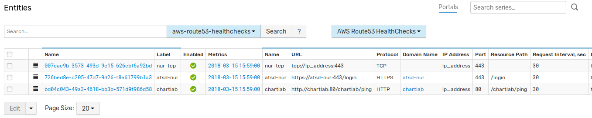

# AWS Route 53

This java application collect information about healthchecks on AWS Route53
and upload it into ATSD as entities with tags.

Result entities will look like following:




## Build from source

- Clone repository

```
cd /home
mkdir aws-route53-atsd
cd aws-route53-atsd
git clone -b aws-route53 https://github.com/axibase/atsd-integration
cd atsd-integration/
```

- Build jar executable using Maven

```
mvn clean package
```

Result package would be created in `target` directory and named `aws-route53-atsd-[version]-jar-with-dependencies.jar`

## Configure

- Create two files: **aws.properties** and **atsd.properties** in `/home/aws-route53-atsd`

```
touch aws.properties
touch atsd.properties
```

**aws.properties** file contains credentials for connecting to AWS Route53

```
aws.access.key=access_key
aws.secret.key=secret_key
aws.region=us-east-1
```

**atsd.properties** file contains parameters for connecting to ATSD using [atsd-api-java](https://github.com/axibase/atsd-api-java)

```
axibase.tsd.api.server.name=localhost
axibase.tsd.api.server.port=8443
axibase.tsd.api.protocol=https
axibase.tsd.api.ssl.errors.ignore=true
axibase.tsd.api.username=axibase
axibase.tsd.api.password=axibase
```

## Run

- Run application using following command (specify path to **aws.properties** and **atsd.properties** with **-Daws.properties** and **-Daxibase.tsd.api.client.properties** parameters)

```
cd target
java -Daxibase.tsd.api.client.properties=/home/aws-route53-atsd/atsd.properties -Daws.properties=/home/aws-route53-atsd/aws.properties -jar aws-route53-atsd-1.0-jar-with-dependencies.jar
```

- Check if entities were created in ATSD

- Also this task may be added to cron

```
crontab -e
```

Add job in cron file (execute every minute)

```
* * * * * java -Daxibase.tsd.api.client.properties=/home/aws-route53-atsd/atsd.properties -Daws.properties=/home/aws-route53-atsd/aws.properties -jar /home/aws-route53-atsd/atsd-integration/target/aws-route53-atsd-1.0-jar-with-dependencies.jar
```